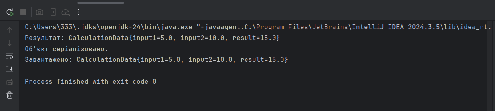
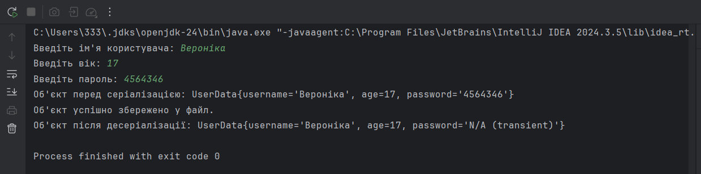
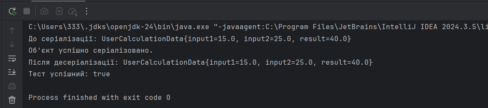
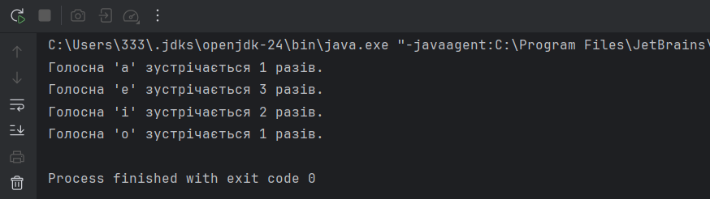

# Робота з файлами та обробка даних у Java

## Опис завдання

Завдання передбачає використання роботи з файлами, серіалізації/десеріалізації та обробки рядків у Java.

1. Створити серіалізований клас для збереження параметрів і результатів обчислень. Використати агрегування для знаходження розв’язку.
2. Розробити демонстраційний клас для збереження та відновлення стану об’єкта через серіалізацію, показати використання transient полів.
3. Написати тестовий клас для перевірки коректності обчислень і серіалізації. Використати коментарі javadoc для документації.
4. Підрахувати голосні у рядку, визначити кількість кожної голосної літери.  

## Скріншоти виконання програм

Перше завдання

Друге завдання

Третє завдання

Четверте завдання

## Опис

### 1. Серіалізація та обчислення
- Програма демонструє основи обчислень, серіалізації та десеріалізації в Java.
- Зберігає параметри обчислень у класі `CalculationData`, який підтримує серіалізацію.
- Виконує обчислення (додавання двох чисел) у класі `Solver`.
- Виводить результат у консоль.
- Серіалізує об'єкт `CalculationData` у файл `data.ser`.
- Десеріалізує об'єкт із файлу та виводить його вміст.

### 2. Демонстрація серіалізації
- Програма ілюструє роботу з потоками вводу/виводу, серіалізацією та модифікатором `transient`.
- Отримує від користувача ім'я, вік і пароль через консоль.
- Створює об'єкт `UserData` (при цьому поле `password` позначене як `transient`, тому не зберігається під час серіалізації).
- Виконує серіалізацію об'єкта у файл `userdata.ser`.
- Десеріалізує об'єкт із файлу та виводить його вміст.
- Демонструє, що поле `password` не зберігається після десеріалізації.

### 3. Тестування серіалізації
- Програма демонструє роботу з об'єктною серіалізацією, десеріалізацією та базовим тестуванням обчислень.
- Створює об'єкт `UserCalculationData` з двома числами.
- Виконує обчислення (знаходить суму двох чисел).
- Виводить результат у консоль перед серіалізацією.
- Серіалізує об'єкт у файл `userdata_calculation_data.ser`.
- Десеріалізує об'єкт із файлу.
- Порівнює результати до та після серіалізації для перевірки коректності.

### 4. Підрахунок голосних у рядку
- Програма підраховує кількість кожної голосної літери у заданому рядку.
- Перетворює рядок у нижній регістр для коректного підрахунку.
- Перебирає всі символи у рядку.
- Перевіряє, чи є символ голосною (`a, e, i, o, u`).
- Підраховує кількість входжень кожної голосної у `Map<Character, Integer>`.
- Виводить результат – скільки разів зустрічається кожна голосна літера.

## Посилання на файли

[main.java](main.java)

[main2.java](main2.java)

[main3.java](main3.java)

[main4.java](main4.java)

## Запитання для елементарного рівня
1. **Агрегація в ООП** – це зв’язок між класами, коли один клас містить інший, але вкладений об’єкт може існувати окремо від контейнера.
2. **Агрегація** – це особливий вид асоціації, який забезпечує слабкий зв’язок між класами. Головний об’єкт може існувати без залежного.
3. **Композиція** – це сильний зв’язок між класами, коли вкладений об’єкт створюється та знищується разом із контейнером.
4. **Делегування** – це передача виконання завдання іншому об’єкту, коли один метод викликає інші об’єкти для реалізації логіки.
5. **Серіалізація** – це процес перетворення об’єкта у потік байтів для його збереження або передачі.
6. **Серіалізація/десеріалізація з використанням `Serializable`**:
    - Клас має імплементувати `Serializable`.
    - Для запису та зчитування використовують `ObjectOutputStream` і `ObjectInputStream`.
7. **Серіалізація/десеріалізація з використанням`Externalizable`**:
    - Клас імплементує `Externalizable`.
    - Потрібно реалізувати методи `writeExternal` і `readExternal` вручну.
8. **Transient**  після десеріалізації отримують значення за замовчуванням (`null, 0, false`).
9. **Static** поля не серіалізуються, оскільки належать класу, а не конкретному об’єкту.
10. **Javadoc** – це інструмент для автоматичної генерації документації з коментарів у коді (`/** ... */`).  
