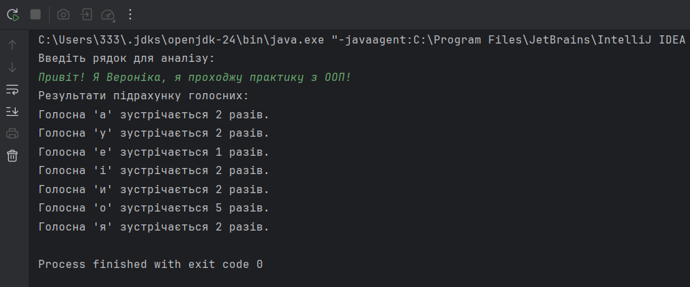

# Спадкування

## Опис завдання

1. Як основа використовувати вихідний текст проекту попередньої лабораторної роботи. Забезпечити розміщення результатів обчислень уколекції з можливістю збереження/відновлення.
2. Використовуючи шаблон проектування Factory Method (Virtual Constructor), розробити ієрархію, що передбачає розширення рахунок додавання
   нових відображуваних класів.
3. Розширити ієрархію інтерфейсом "фабрикованих" об'єктів, що представляє набір методів для відображення результатів обчислень.
4. Реалізувати ці методи виведення результатів у текстовому виде.
5. Розробити тареалізувати інтерфейс для "фабрикуючого" методу

## Скріншоти виконання програми

## Опис
Java-програма, яка підраховує кількість кожної голосної літери в рядку, введеному користувачем, і виводить результати. Вона реалізує кілька важливих концепцій ООП, таких як інтерфейси, абстракція та фабричний метод.

## Посилання на файл

[main3.java](main3.java)
