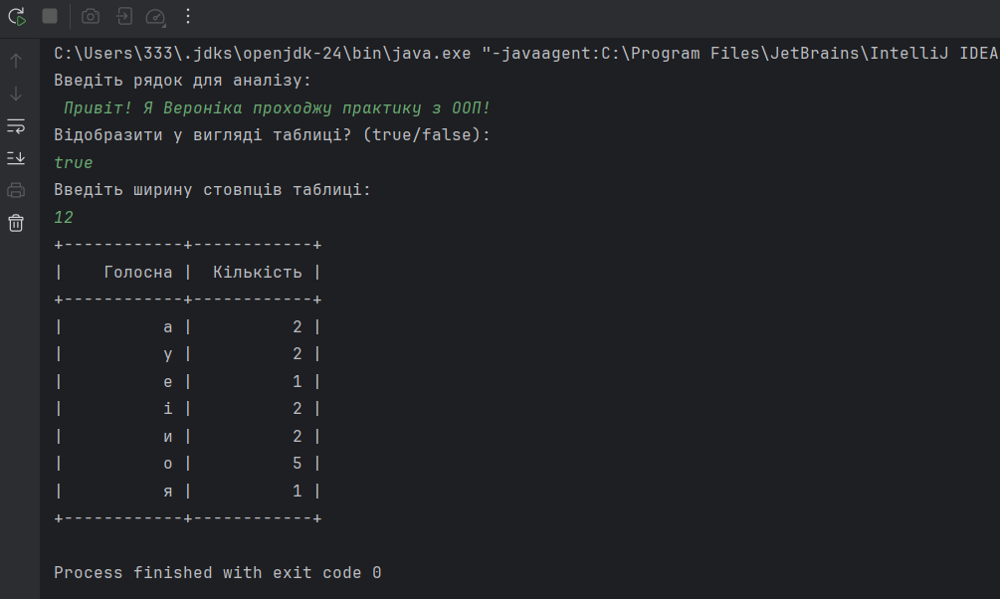

## Поліморфізм

## Опис завдання

1. За основу використовувати вихідний текст проекту попередньої лабораторної роботи Використовуючи шаблон проектування Factory Method
(Virtual Constructor), розширити ієрархію похідними класами, реалізують методи для подання результатів у вигляді текстової
таблиці. Параметри відображення таблиці мають визначатися користувачем.
2. Продемонструвати заміщення (перевизначення, overriding), поєднання (перевантаження, overloading), динамічне призначення методів
(Пізнє зв'язування, поліморфізм, dynamic method dispatch).
3. Забезпечити діалоговий інтерфейс із користувачем.
4. Розробити клас для тестування основної функціональності.
5. Використати коментарі для автоматичної генерації документації засобами javadoc

## Скріншоти виконання програм

## Опис

### 1. Призначення програми
- Ця програма аналізує введений користувачем рядок і підраховує кількість голосних літер. Користувач може обрати два режими відображення результату:

- Таблиця з вирівняними колонками, де ширину стовпців задає користувач.

### 2. Використані шаблони та принципи ООП
- **Factory Method** (Virtual Constructor) – використовується для створення об'єктів різних класів `VowelCounterFactory`.

- **Поліморфізм** (dynamic method dispatch) – метод `display()` викликається відповідно до об'єкта, який створено.

- **Перевизначення** (Overriding) – клас `TableVowelCounter` перевизначає метод `display()` для відображення у вигляді таблиці.

- **Перевантаження** (Overloading) – фабричний метод підтримує варіації параметрів для різних форматів виводу.

### 3. Взаємодія з користувачем
- Користувач вводить рядок для аналізу.

- Вибирає, чи відображати результат у вигляді таблиці `true/false`.

- Якщо вибрано таблицю, задає ширину стовпців.

- Програма обробляє текст і виводить підрахунок голосних у вибраному форматі.

## Посилання на файли

[main4.java](main4.java)
