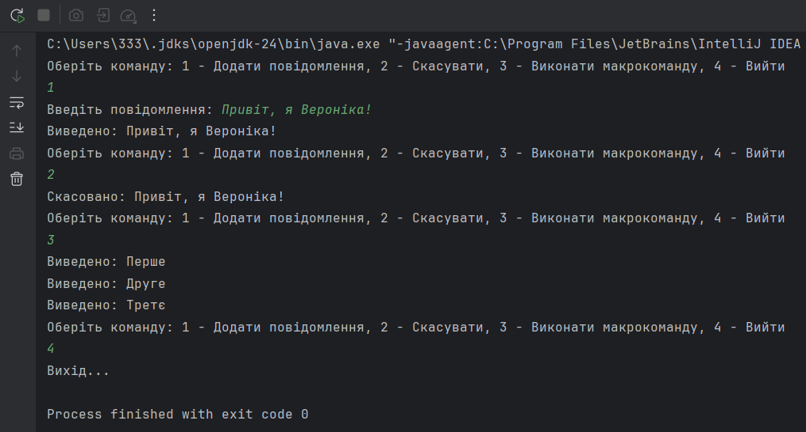

## Обробка колекцій 

## Опис завдання

1. Реалізувати можливість скасування (undo) операцій (команд).
2. Продемонструвати поняття "макрокоманда"
3.  При розробці програми використовувати шаблон Singletone.
4. Забезпечити діалоговий інтерфейс із користувачем.
5. Розробити клас для тестування функціональності програми.

## Скріншоти виконання програми

## Опис

### 1. Реалізація можливості скасування (undo) операцій
Програма використовує стек (`Stack<Command> commandStack`) у класі `CommandManager`, щоб зберігати виконані команди.  
Метод `undo()` скасовує останню команду, якщо стек не порожній.

### 2. Демонстрація поняття "макрокоманда"
Реалізований клас `MacroCommand`, який дозволяє виконувати набір команд одночасно.  
Він містить список (`List<Command> commands`), у якому зберігаються команди.  
При виконанні (`execute()`) запускаються всі команди списку, а при скасуванні (`undo()`) вони відкочуються у зворотному порядку.

### 3. Використання шаблону Singleton
Клас `CommandManager` реалізований як **Singleton**:
- Має **приватний конструктор** для запобігання створенню екземплярів напряму.
- Використовує **статичний метод `getInstance()`**, який повертає єдиний екземпляр класу.

### 4. Діалоговий інтерфейс з користувачем
Програма працює в **консольному режимі**, очікуючи введення команд від користувача:
- `1` – введення та виконання команди.
- `2` – скасування останньої виконаної команди.
- `3` – виконання макрокоманди (набір команд).
- `4` – вихід із програми.

### 5. Розробка класу для тестування функціональності програми
Тестування виконується через інтерфейс користувача.  
Введення команд і їхня обробка демонструє:
- виконання команд,
- можливість скасування,
- виконання макрокоманд.

## Посилання на файл

[main5.java](main5.java)
