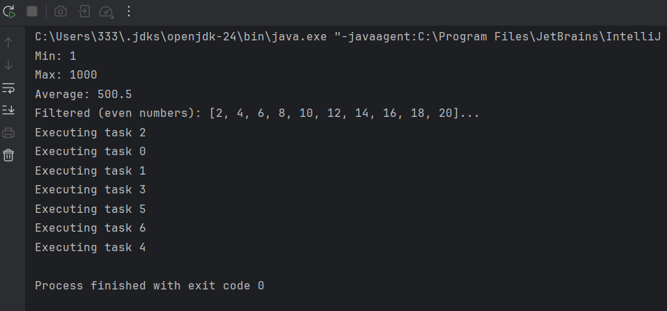

## Паралельне виконання

## Опис завдання 

1. Продемонструвати можливість паралельної обробки елементів колекції (пошук мінімуму, максимуму, обчислення середнього значення, відбір за критерієм, статистична обробка тощо).
2. Управління чергою завдань (команд) реалізувати за допомогою шаблону `WorkerThread`.

## Скріншот виконання програми

## Опис 

Ця програма демонструє **паралельну обробку колекції** та **управління чергою завдань** за допомогою шаблону `Worker Thread`.

### 1. Паралельна обробка колекції

Програма створює список чисел від `1` до `1000` і використовує `parallelStream()` для виконання таких операцій у потоках:
- **Пошук мінімального значення**
- **Пошук максимального значення**
- **Обчислення середнього значення**
- **Фільтрація парних чисел**

Для цього використовується `ExecutorService` з 4 потоками, а обчислення виконуються асинхронно через `Future<T>`.

### 2. Управління чергою завдань (Worker Thread)

Реалізовано клас `WorkerThread`, який управляє чергою завдань. Він використовує:
- `LinkedList<Runnable>` для зберігання задач
- `ExecutorService` з `FixedThreadPool(3)` для виконання завдань у трьох потоках

Програма додає **7 завдань**, які виводять `Executing task X`.

## Посилання на файл

[main6.java](main6.java)
