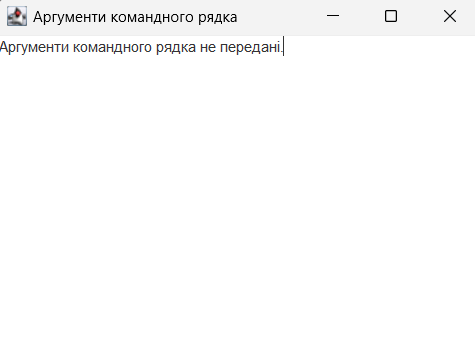
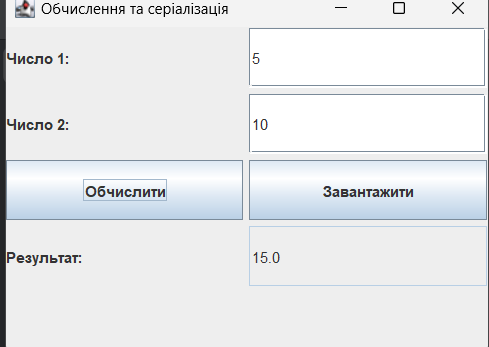
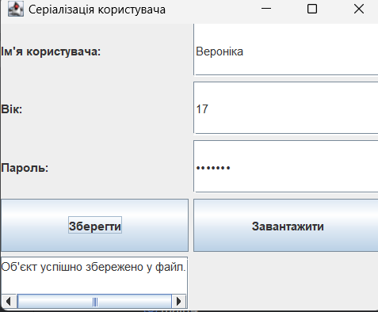
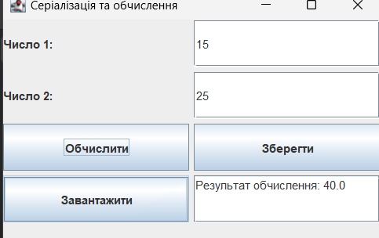
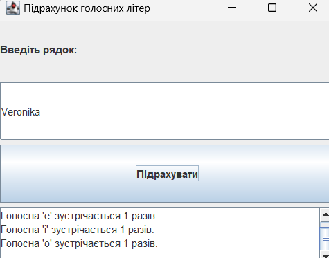
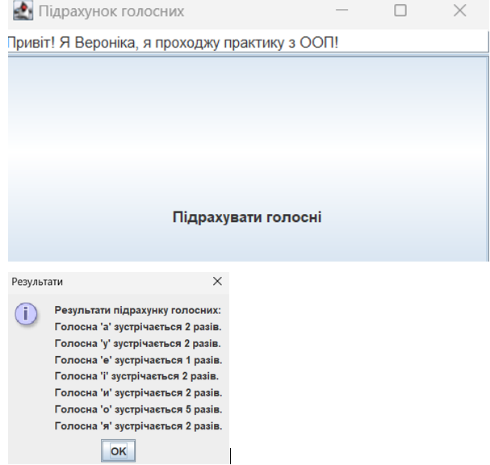
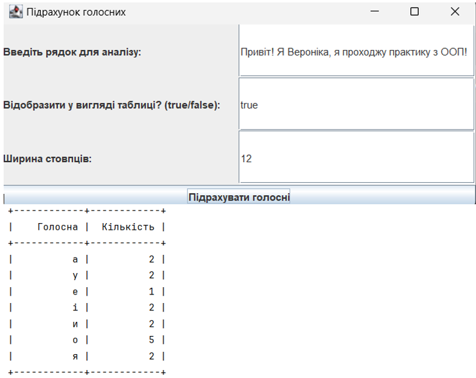
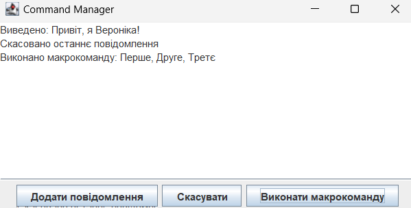
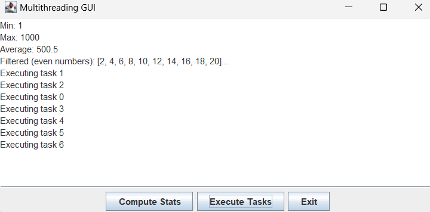

# Графічний інтерфейс 

## Вступ до **Swing**

**Swing** — це бібліотека для створення графічного інтерфейсу користувача (GUI) у Java. Вона є частиною `javax.swing` і дозволяє створювати вікна, кнопки, текстові поля, таблиці та інші елементи інтерфейсу.

## Скріншоти виконання програм

### Завдання 1

### Завдання 2 (1)

### Завдання 2 (2)

### Завдання 2 (3)

### Завдання 2 (4)

### Завдання 3

### Завдання 4

### Завдання 5

### Завдання 6

## Висновок
У результаті виконання 6 завдань було створено набір програм, що демонструють роботу з вхідними аргументами, серіалізацією та графічним інтерфейсом у Java.

## Посилання на файли

[main1.java](main1.java)

[main2_1.java](main2_1.java)

[main2_2.java](main2_2.java)

[main2_3.java](main2_3.java)

[main2_4.java](main2_4.java)

[main3.java](main3.java)

[main4.java](main4.java)

[main5.java](main5.java)

[main6.java](main6.java)